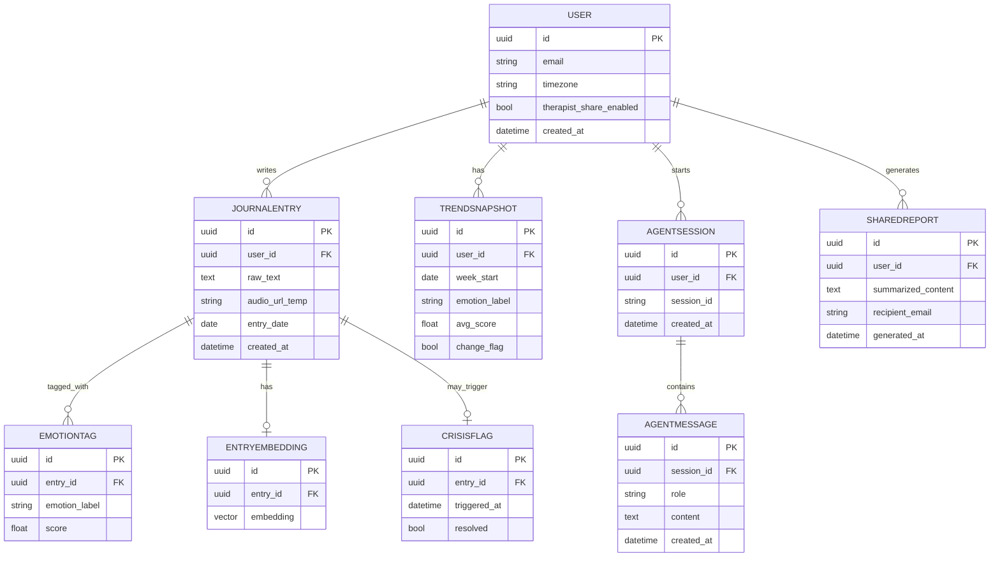
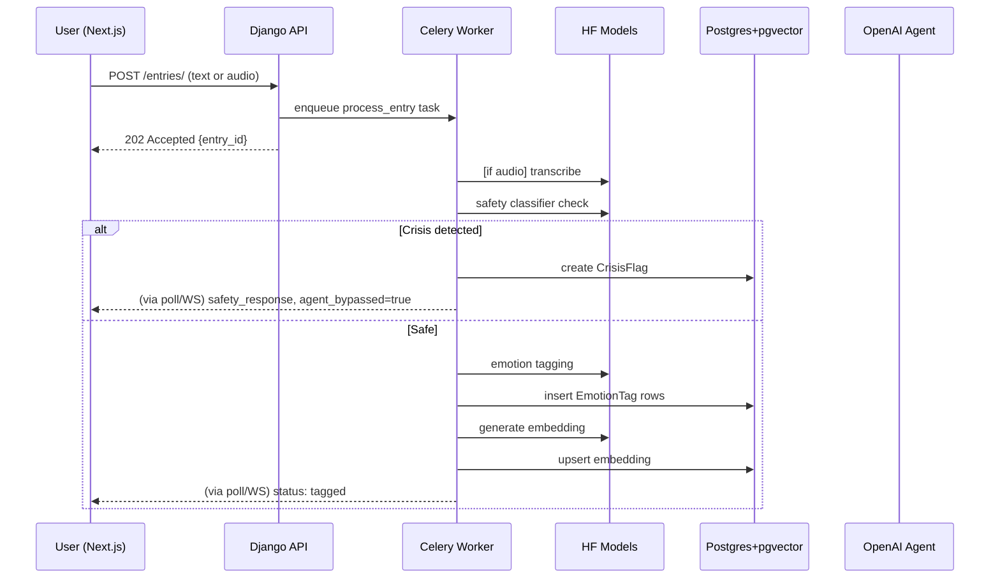

# MindTrace — Complete Software Requirements Specification & System Design
### Personal Journaling & Emotional Pattern Intelligence Platform

---

## 1. Purpose & Scope

**Purpose:** MindTrace lets a user journal (text or voice), automatically tags emotional content using HuggingFace models, tracks trends over time, and provides a RAG-grounded OpenAI agent that reflects patterns back to the user — never diagnosing, never giving clinical advice — with a hard safety layer for crisis-language detection.

**In scope (v1):** text/voice journaling, emotion tagging, trend computation, RAG-based reflection Q&A, weekly auto-summaries, optional therapist-facing summarized reports, crisis-language safety guardrail.

**Out of scope (v1):** clinical diagnosis of any kind, live wearable integration, multi-user/family accounts, non-English journaling, mobile native apps (responsive web only for v1).

---

## 2. Stakeholders & User Roles

| Role | Description |
|---|---|
| **User** | The journaler — full access to their own data, agent, and settings |
| **Shared Recipient (optional)** | A therapist/trusted person the user explicitly grants access to a *summarized* (never raw) report |
| **System/Admin** (you, as the developer) | Access to aggregate, anonymized system health metrics only — never individual user content, enforced at the infrastructure level |

---

## 3. Functional Requirements

1. Users can create journal entries via text input or voice recording (transcribed automatically).
2. System shall tag each entry with multi-label emotion scores (e.g., anxiety, sadness, joy, calm, anger) using a HuggingFace model.
3. System shall compute rolling trend statistics per emotion label (weekly/monthly) via a deterministic, non-LLM statistical pipeline.
4. System shall detect significant trend changes (e.g., a sustained rise in anxiety-language) and surface them to the user.
5. Users can ask natural-language questions about their own journal history and receive RAG-grounded, cited answers.
6. System shall auto-generate a weekly reflective summary.
7. System shall detect crisis-indicating language in any entry and, upon detection, bypass all generative AI and show a static, pre-approved safety-resource message instead.
8. Users can generate and share a summarized (not raw-text) report with a designated recipient (e.g., therapist).
9. Users can export or permanently delete all their data at any time (data ownership/right-to-erasure).
10. System shall maintain per-user conversational memory for the reflection agent within a session.

---

## 4. Non-Functional Requirements

- **Privacy-by-design:** raw journal text and audio are the most sensitive data in the system — encrypted at rest, never used for any purpose beyond the user's own features (no aggregate training on user content without explicit opt-in), never sent to third parties beyond the minimum needed for the active AI call.
- **Performance:** entry tagging completes within 15 seconds of submission; agent Q&A responses return within 5 seconds for a typical query.
- **Availability:** 99.5% target uptime.
- **Auditability:** every agent response and every crisis-flag trigger is logged (append-only) for safety review, even though raw content is never exposed to system admins in the UI.
- **Data ownership:** full export and full deletion must be self-service, one-click, and complete (including backups, per a defined retention window).

---

## 5. Assumptions & Constraints

- English-language entries only in v1.
- Voice notes are transcribed and only the transcript (not the raw audio) is retained beyond a short processing window, minimizing biometric-data exposure.
- OpenAI is used only for the reflection/summary agent — never for the emotion-tagging of raw entries at rest (that's the HuggingFace model's job, running in your own worker, minimizing what leaves your infrastructure).
- Crisis-language detection uses a **combination of a keyword/pattern list and a HuggingFace classifier** run before any entry ever reaches the OpenAI agent layer — this ordering is a deliberate safety design choice.

---

## 6. Complete System Architecture

```
                              ┌───────────────────────────┐
                              │        Next.js UI          │
                              │ (Journal editor, Trends,    │
                              │  Reflection Chat, Settings) │
                              └─────────────┬─────────────┘
                                            │ HTTPS
                              ┌─────────────▼─────────────┐
                              │           Nginx             │
                              │   (TLS termination, LB)     │
                              └─────────────┬─────────────┘
                                            │
                       ┌────────────────────▼────────────────────┐
                       │        Django + DRF (Gunicorn)             │
                       │  Auth · Entries CRUD · Agent Trigger API   │
                       └───────┬─────────────────────┬─────────────┘
                               │                      │
                  ┌────────────▼──────┐    ┌──────────▼──────────┐
                  │      Redis          │    │    PostgreSQL         │
                  │ (broker/cache/      │    │    + pgvector          │
                  │  agent memory)      │    │ (encrypted at rest)   │
                  └────────┬────────────┘    └──────────┬───────────┘
                           │                             │
              ┌────────────▼─────────────────────────────▼────────────┐
              │                  Celery Workers                        │
              │  ┌───────────┐ ┌───────────────┐ ┌────────────────┐   │
              │  │ Transcribe│ │ Emotion Tag   │ │ Trend Compute   │   │
              │  │ (Whisper/ │ │ (HF classifier│ │ (statistical,   │   │
              │  │  HF ASR)  │ │  + crisis      │ │  non-LLM)       │   │
              │  │           │ │  detector)     │ │                 │   │
              │  └───────────┘ └───────┬───────┘ └─────────────────┘   │
              │                        │ (only if SAFE)                │
              │                ┌───────▼────────┐                      │
              │                │ Reflection Agent│                      │
              │                │  (OpenAI, RAG)  │                      │
              │                └─────────────────┘                      │
              └──────────────────────────────────────────────────────────┘

   Monitoring: Prometheus + Grafana (infra only) · Sentry (errors, PII-scrubbed)
   CI/CD: GitHub Actions → test → Docker build → deploy (Render/AWS)
```

**Key design note:** the crisis-detector sits *before* the OpenAI call in the pipeline, not after — it's a gate, not a filter on the output. This ordering is worth explicitly stating in interviews: you never let a generative model be the first thing that responds to a potential crisis signal.

---

## 7. ER Diagram



---

## 8. API Documentation

```
Auth
POST   /api/auth/register/
POST   /api/auth/login/                    → JWT access + refresh
POST   /api/auth/refresh/
POST   /api/auth/logout/
DELETE /api/auth/account/                   full account + data deletion (self-service)
GET    /api/auth/export/                    full data export (JSON/PDF)

Journal
POST   /api/entries/                       {text} or {audio file} → 202 Accepted, triggers pipeline
GET    /api/entries/                        list, filterable by date range, emotion label
GET    /api/entries/{id}/
DELETE /api/entries/{id}/

Trends
GET    /api/trends/summary/?range=weekly    cached trend chart data
GET    /api/trends/changes/                  detected significant shifts

Reflection Agent
POST   /api/reflect/ask/                    {question, session_id} → grounded answer + citations
GET    /api/reflect/weekly-summary/          latest auto-generated summary
POST   /api/reflect/session/new/             starts a fresh memory session

Sharing
POST   /api/share/report/                    {recipient_email} → generates summarized PDF, emails link
GET    /api/share/report/{token}/            recipient-facing read-only view (no raw entries ever)
```

**Sample — `POST /api/reflect/ask/`:**
```json
// Request
{ "question": "How has my anxiety been lately compared to last month?", "session_id": "sess_a1" }

// Response
{
  "answer": "Your anxiety-related language has increased over the past 3 weeks compared to last month, particularly around work-related entries. You mentioned deadlines in 6 of your last 10 entries.",
  "citations": [
    { "entry_id": "e_991", "entry_date": "2026-07-14" },
    { "entry_id": "e_1002", "entry_date": "2026-07-18" }
  ],
  "session_id": "sess_a1"
}
```

**Crisis-path response (no LLM call made):**
```json
{
  "status": "safety_response",
  "message": "It looks like you might be going through something really difficult right now. Here are some resources that can help.",
  "resources": [ "..." ],
  "agent_bypassed": true
}
```

---

## 9. Folder Structure

```
mindtrace/
├── config/
│   ├── settings/{base,dev,prod}.py
│   ├── celery.py
│   └── urls.py
├── apps/
│   ├── accounts/            auth, export, deletion
│   ├── journal/              entries, audio upload handling
│   ├── transcription/        Whisper/HF ASR wrapper
│   ├── emotion/               HF emotion-classifier service
│   ├── safety/                 crisis-language detector (keyword + classifier), gating logic
│   ├── search/                 embeddings, pgvector hybrid retrieval
│   ├── trends/                  statistical trend computation (non-LLM)
│   ├── agents/
│   │   ├── reflection_agent.py
│   │   ├── memory.py            Redis-backed session memory
│   │   └── prompts/             versioned prompt files
│   └── sharing/                 summarized report generation
├── tasks/                        celery task definitions
├── frontend/                      Next.js: journal editor, trends dashboard, chat, settings
├── infra/
│   ├── docker/
│   ├── nginx/
│   └── github-actions/
└── tests/
```

---

## 10. AI Pipeline (End-to-End)

```
Entry submitted (text or audio)
   → [if audio] Celery: transcribe (Whisper/HF ASR) → discard raw audio after short retention window
   → [Celery] Safety check: keyword list + HF crisis-classifier
        → if TRIGGERED: create CrisisFlag, return static safety response, STOP (no further AI processing)
        → if SAFE: continue
   → [Celery] Emotion tagging (HF multi-label classifier) → EmotionTag rows
   → [Celery] Embedding generation (Sentence-Transformers) → pgvector upsert
   → [Celery-beat, nightly] Trend recomputation (statistical, deterministic) → TrendSnapshot rows
   → [Celery-beat, weekly] Auto-summary generation (OpenAI agent, RAG over week's entries + trend data)

On-demand:
Question → Safety check (question text too) → Hybrid retrieval (semantic + date filters)
   → Reflection Agent (OpenAI, function-calling: fetch_trend_data, fetch_entries_by_range)
   → Grounded answer with citations → stored in AgentMessage + Redis session memory
```

---

## 11. Prompt Engineering Strategy

- **Versioned, reviewable prompts** — every agent prompt is a file (`reflection_agent_v3.txt`), never an inline string, so you can diff changes and log which version generated which response (`AgentMessage.prompt_version`).
- **Hard grounding instruction:** system prompt explicitly states the agent must only reference entries actually retrieved, must cite entry dates, and must decline to speculate beyond what's in the retrieved context.
- **Explicit non-clinical framing baked into every system prompt:** the agent is instructed to reflect patterns descriptively ("you've mentioned deadlines frequently") and never diagnostically ("this suggests generalized anxiety disorder") — this single instruction is one of the most important lines in the whole prompt, and one you should be ready to discuss in detail in interviews as your core responsible-AI decision.
- **Tone calibration via few-shot examples:** 2–3 example Q&A pairs in the system prompt showing warm, non-clinical, grounded phrasing, so outputs are consistent in tone.
- **Weekly summary prompt** is structurally different from the Q&A prompt — it's given the week's trend deltas explicitly as structured data (not just raw entries) so it doesn't have to "guess" at trend direction from text alone; this reduces hallucinated trend claims.

---

## 12. RAG Architecture

```
Query → Safety check (question text run through crisis detector too — a user could disclose crisis intent inside a question)
     → Query embedding (Sentence-Transformers)
     → Hybrid retrieval:
          (a) pgvector cosine similarity, top-15, scoped to user_id (hard filter, never cross-user)
          (b) date-range filter if question implies a timeframe ("last month")
     → Merge + light rerank (recency-weighted, since recent entries are usually more relevant for "lately" questions)
     → Assembled context (entry text + date + emotion tags) → Reflection Agent (OpenAI)
     → Answer + citations back to specific entries
```

The recency-weighting step is a deliberate departure from pure similarity search — worth naming explicitly, since it shows you understand that generic RAG defaults (pure cosine similarity) aren't always right for every domain; personal journaling has a strong recency bias that a naive implementation would miss.

---

## 13. Authentication Flow

```
1. Register → Django creates User (single-tenant per-user model; no organizations here)
2. Login → JWT access (15 min) + refresh (7 days), SimpleJWT
3. Every request → IsAuthenticated + IsOwner permission (queryset auto-filtered by request.user)
4. Shared reports use a separate, scoped, single-purpose access token (not a full user JWT) — the
   recipient never logs in as the user, they access a read-only, summarized, token-gated view only
5. Refresh rotation + blacklist on logout (SimpleJWT blacklist app)
6. Account deletion: cascades through all tables + purges S3/audio temp storage + revokes all tokens
```

---

## 14. Sequence Diagram — Entry Submission → Safe Processing



---

## 15. Deployment Pipeline

```
Push → GitHub Actions:
  1. Lint + type check + unit tests (pytest, incl. safety-detector test suite with adversarial examples)
  2. Build Docker images (web, worker, beat, frontend), tag with commit SHA
  3. Push to registry
  4. Run migrations on staging
  5. Deploy to staging → smoke tests (incl. a safety-path smoke test — this must never silently break)
  6. Manual approval → production deploy
```

A dedicated, always-run test suite for the crisis-detector (a fixed set of known trigger phrases that must always route to the safety path) is worth calling out specifically — it's the one part of this system where a regression is unacceptable, and testing for that is a strong engineering-maturity signal.

---

## 16. Docker Architecture

```
docker-compose.yml services:
  - web       (Django + Gunicorn)
  - worker    (Celery worker)
  - beat      (Celery beat — nightly trend compute, weekly summaries)
  - redis
  - postgres  (pgvector extension)
  - nginx
  - frontend  (Next.js)

Production: same images on AWS ECS Fargate or Render; worker scaled independently from web
(worker load is spikier — bursts of entries in the evening — web load is steadier).
```

---

## 17. Database Design Notes

- `pgvector` HNSW index on `EntryEmbedding.embedding` for fast per-user semantic search.
- **Every query touching `JournalEntry`, `EmotionTag`, or `EntryEmbedding` is scoped by `user_id` at the manager level** — no view-level filtering alone; this is your primary defense against any accidental cross-user data leak, which would be catastrophic for this kind of data.
- `CrisisFlag` table is append-only at the DB role level (no UPDATE/DELETE grants) for safety auditability.
- Audio files (`audio_url_temp`) live in object storage with a short TTL lifecycle policy (auto-deleted after transcription, e.g., 24 hours) — enforced via S3 lifecycle rules, not application logic alone (belt and suspenders).

---

## 18. Celery Workflow

```python
# tasks/pipeline.py (conceptual)
process_entry = chain(
    transcribe_if_audio.s(entry_id),
    safety_check.s(),                # short-circuits the chain if triggered
    tag_emotions.s(),
    generate_embedding.s(),
)

# celery beat schedule
CELERY_BEAT_SCHEDULE = {
    'nightly-trend-recompute': {'task': 'trends.recompute_all', 'schedule': crontab(hour=2)},
    'weekly-summary-generation': {'task': 'agents.generate_weekly_summaries', 'schedule': crontab(day_of_week=0, hour=8)},
    'audio-cleanup': {'task': 'journal.purge_expired_audio', 'schedule': crontab(hour='*/6')},
}
```
The `safety_check` task uses Celery's ability to short-circuit a chain (raising a controlled exception that the chain catches and reroutes) rather than letting a flagged entry silently continue to tagging/embedding — worth describing explicitly as a "fail-safe, not fail-open" design choice.

---

## 19. Redis Usage

1. **Celery broker** for all async tasks.
2. **Cache** for trend-chart aggregates (`cache.set('user:{id}:trends:weekly', ..., timeout=3600)`).
3. **Agent session memory** (`agent:session:{session_id}`, TTL 24h) — conversation history for the reflection agent.
4. **Rate limiting** on `/reflect/ask/` (a user shouldn't be able to hammer the OpenAI-backed endpoint — both a cost control and an abuse-prevention measure).
5. **Idempotency locks** to prevent double-processing the same entry if a retry fires.

---

## 20. Security Considerations

- **Encryption at rest** for `JournalEntry.raw_text` (application-level column encryption, not just disk-level, given the sensitivity) and audio storage.
- **Strict per-user query isolation** at the ORM manager level, tested explicitly (a test that asserts User A can never retrieve User B's entries via any endpoint).
- **No third-party analytics/tracking SDKs** on pages that touch journal content — a genuine product decision, not just a technical one, and worth stating plainly to interviewers as evidence you think about privacy holistically, not just as an encryption checkbox.
- **Minimal data sent to OpenAI:** only the retrieved entry snippets needed for the specific question, never the user's entire history in one call; no raw audio ever sent to any third party beyond the transcription step.
- **Right-to-erasure:** full deletion cascades through Postgres, object storage, Redis session memory, and any logs — tested as part of the CI safety suite, not just documented.
- **Crisis-response resources reviewed and hard-coded**, not generated — this content should not be model-authored, ever.

---

## 21. Cost Estimation (demo/portfolio scale)

| Component | Approx. monthly cost |
|---|---|
| Render/AWS compute (web+worker+beat) | $20–50 |
| PostgreSQL (managed, small, with pgvector) | $15–25 |
| Redis (managed, small) | $10 |
| Object storage (short-lived audio only) | <$5 |
| OpenAI API (weekly summaries + on-demand Q&A, light usage) | $10–30 |
| HF inference (emotion tagging, safety classifier — can self-host free-tier) | $0–15 |
| **Total** | **~$55–135/month** |

Notice the OpenAI cost here is *lower* than ContractIQ's — because most of the heavy, frequent work (tagging every entry, checking every entry for safety) runs on HuggingFace models, and OpenAI is only invoked for the comparatively rare "generate a thoughtful answer/summary" step. That's the same architectural principle from Part 1 of your original brief, just made concrete with real numbers — a good thing to be able to say out loud in an interview.

---

## 22. Scaling Strategy to 1 Million Users

1. **Stateless Django tier** behind Nginx/ALB, horizontally scaled; sessions in Redis/JWT only.
2. **Celery queues split by workload shape:** `transcription` (CPU/GPU-bound, bursty), `tagging` (steady, high-volume), `agent` (latency-sensitive, rate-limited by OpenAI cost) — each scaled independently so a wave of evening journal entries doesn't delay someone's Q&A response.
3. **Database:** read replicas for trend/dashboard queries; primary for writes; since data is naturally per-user, **sharding by user_id hash** across multiple Postgres instances is a clean scaling path once a single instance's I/O becomes the bottleneck (this is a much cleaner shard key than ContractIQ's org-based one, worth noting as a system-design contrast).
4. **Vector search at scale:** pgvector remains viable longer here than in a multi-tenant B2B system, since each user's own entry count is naturally bounded (a person doesn't journal a million times); still, migrate to a dedicated vector DB with per-user namespacing if aggregate volume demands it.
5. **Cost control at scale:** cache identical/near-identical questions per user (people re-ask similar things — "how am I doing lately"); batch weekly-summary generation efficiently rather than one API call per user in real time; consider a cheaper model tier for routine weekly summaries and reserve GPT-4-class reasoning for on-demand, complex Q&A.
6. **Safety-path scaling:** the crisis-detector must scale *without ever becoming a bottleneck that delays a response* — this is a genuine latency-vs-safety tradeoff worth explicitly designing for: the check should be fast (a lightweight HF classifier, not an LLM call) and always run synchronously before anything else, even under load.
7. **Compliance posture at scale:** at real scale, mental-health-adjacent data likely brings you into HIPAA-adjacent or regional health-data-privacy regulatory territory (depending on jurisdiction and whether therapist-sharing is used) — a real system at this scale would need a compliance review, data-residency decisions, and probably a Business Associate Agreement-equivalent process if partnering with any clinical entities. Naming this limitation out loud in an interview is a maturity signal, not a weakness.
8. **Observability:** structured logging with PII scrubbing before anything reaches third-party tools (Sentry, logging pipelines) — a nontrivial engineering task on its own for this kind of app, and worth budgeting for explicitly rather than treating logging as an afterthought.

---

## Closing Note

Build order I'd suggest: get the **safety gate working first**, even before the "impressive" AI features — a crude keyword-based version is fine initially. Everything else (tagging, trends, RAG agent) can be genuinely fun to build once you know the one part that absolutely cannot fail is already in place. That build order is also a great story on its own: *"I built the safety layer before the feature that makes the demo impressive, because that's the part that actually mattered."*
